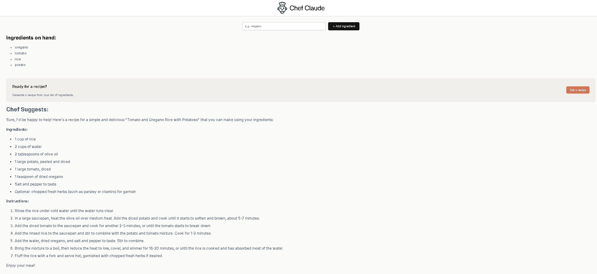

# 🍳 Chef Claude

Chef Claude is a simple AI-powered recipe generator built with **React + Vite**.  
You enter the ingredients you have on hand, and Chef Claude suggests a recipe using **Anthropic Claude** or **Hugging Face Mistral**.  
Recipes are displayed in clean, readable markdown for an easy cooking experience.

---

## 📸 Screenshot



---

## ✨ Features

- Add ingredients dynamically
- Live ingredient list updates as you type
- **Get a recipe** button appears once you have at least 4 ingredients
- AI-powered recipe suggestions using Claude or Mistral
- Recipes rendered beautifully with `react-markdown`
- Minimal, clean design with CSS

---

## 📂 Project Structure

```
App.jsx              → Root component, renders Header + Main
Main.jsx             → Handles state for ingredients + recipe
Header.jsx           → App header with logo + title
IngredientsList.jsx  → Displays ingredient list + "Get a recipe" button
ClaudeRecipe.jsx     → Renders the generated recipe
ai.js                → Functions for calling AI APIs (Claude & Mistral)
index.jsx            → React entry point
index.html           → Root HTML file
index.css            → Styling
recipeCode.md        → Example recipe output
images/              → Logo & screenshot assets
```

---

## ⚡ Setup

1. Clone the repository:
   ```bash
   git clone https://github.com/your-username/chef-claude.git
   cd chef-claude
   ```

2. Install dependencies:
   ```bash
   npm install
   ```

3. Create a `.env` file in the root folder with your API keys:
   ```env
   HF_ACCESS_TOKEN=your_huggingface_key_here
   ```
   ⚠️ Do **not** commit this file to GitHub.

4. Run the development server:
   ```bash
   npm run dev
   ```
   Open in your browser: [http://localhost:5173](http://localhost:5173)

---

## 🛠 How It Works

1. Enter ingredients in the input field.  
2. Ingredients display in a live list.  
3. Once you have 4+ ingredients, the **Get a recipe** button appears.  
4. Clicking it sends your list to Claude or Mistral.  
5. The AI responds with a recipe, displayed in markdown format.


